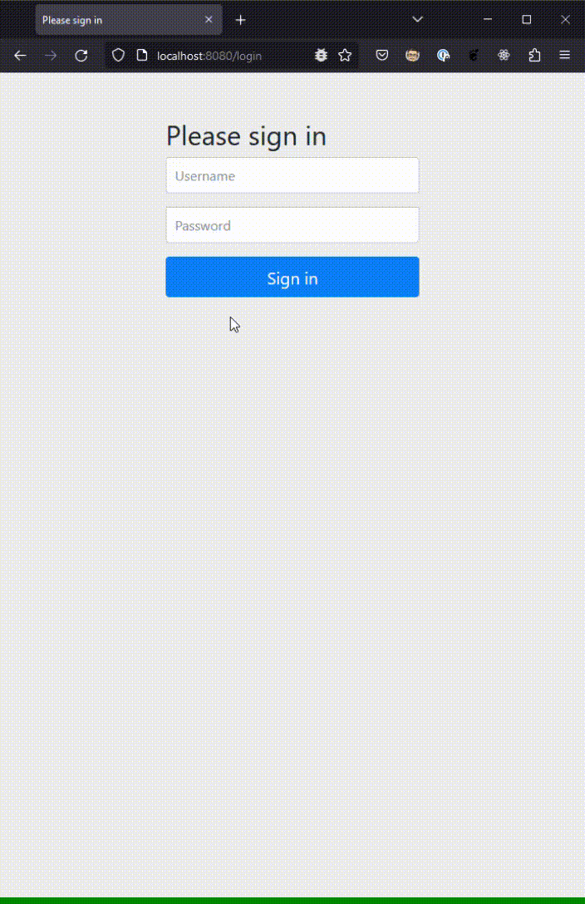
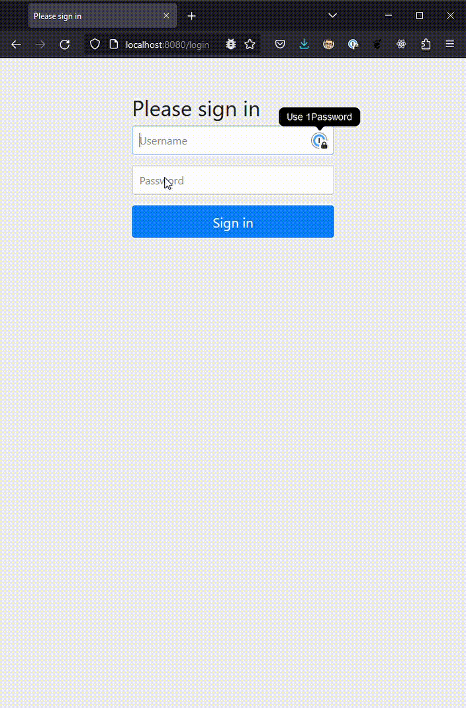
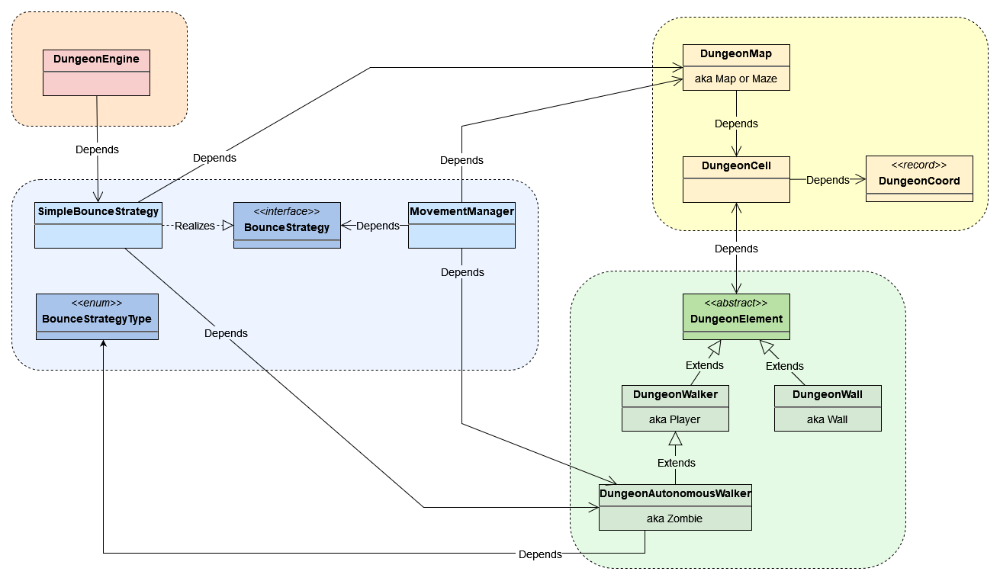
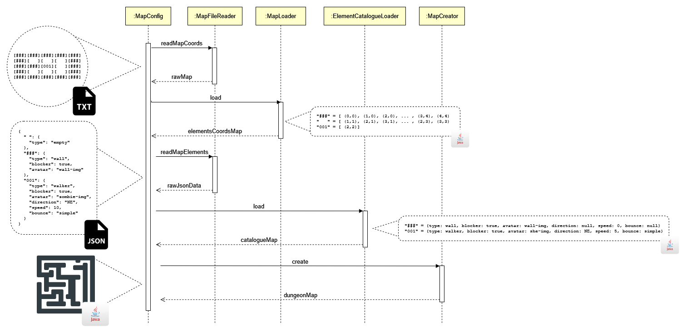
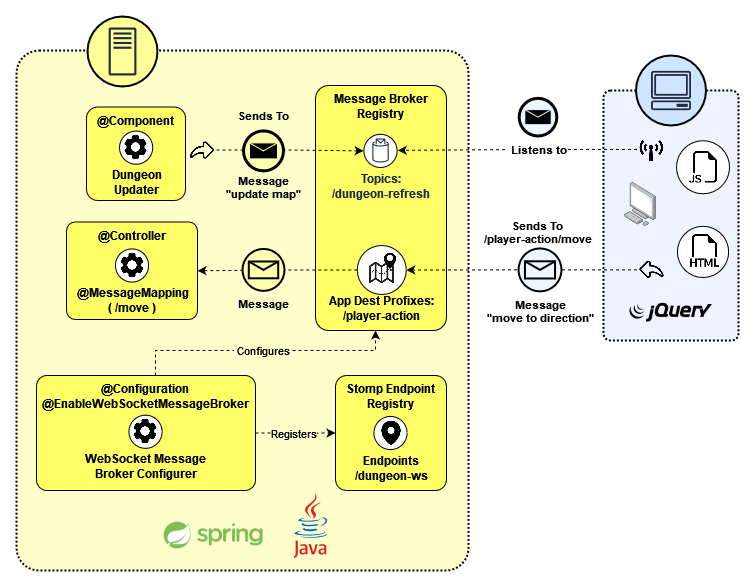

# 🎲 Dungeon Walker

🚧 *Under construction!*

The goal is to create a RPG-like game where one or more users can walk through different dungeon scenarios
facing a different set of adversities. 🎲🎮🕹️

Currently, it's just a dream 💭.

## Current state


## 🙂 Motivation

Use a game scenario to study a set of technologies, such as:

- New Java features since 8 (until 17)
- Spring Boot (Web MVC, Web Sockets, Security, Test, ...)
- Common used Java libraries (lombok, mapstruct, ...)
- Common used unit testing libraries (mockito, hamcrest, ...)
- REST APIs
- Web Sockets
- JQuery
- Docker (TBD)
- Apache Kafka (TBD)
- Some Relational/NoSQL database (TBD)
- GraphQL (TBD)
- Microservices (TBD)
- Kubernetes (TBD)
- Some cloud provider (AWS? GCP?)

## Running the game

### 1. Run using maven

```shell
mvn spring-boot:run
```

### 2. Open your browser

1. 🖥️ Go to `http://localhost:8080/`
2. 🔑 Log in either as user `he` (and password `hepwd`) or `she` (and password `shepwd`).

## 📈 Versions

#### Version 0.0.7

Regardless the size of the dungeon the logged player's avatar will always be centered on the screen now.

#### Version 0.0.6 ([1728b48d](https://github.com/alejoceballos/websocket-dungeon-walker/commit/1728b48d9bf3db5792302104027752957ca27739))

More autonomous avatars in the map moving and bouncing around and more unit and integration tests.



#### Version 0.0.5 ([98ef4ed6](https://github.com/alejoceballos/websocket-dungeon-walker/commit/98ef4ed6e1cd46ff762b80516e05d253cab35261))

Now users can see what directional (arrows) keys they are pressing. Also fixed a little bug that prevented seeing
the user's avatar until an arrow key was pressed.



#### Version 0.0.4 ([6721c45a](https://github.com/alejoceballos/websocket-dungeon-walker/commit/6721c45a2aaf0cb0ed8622d60cc779b91bbccd3d))

What about taking part of the game by driving a character through the maze? Now it is possible to use the arrow keys to
navigate through the dungeon while some dumb zombies keep bouncing the walls! You can also log as two users now, `he`
or `she` for a more interactive game.


#### Version 0.0.3 ([62f1e70b](https://github.com/alejoceballos/websocket-dungeon-walker/commit/62f1e70b6ba31d8ace8edb41ea5d66eaf3f42280))

Dungeon now has images! The walls are painted, and we have a beautiful zombie head bouncing all over! Also you can set
the speed of walkers from 1 to 10 now. Just set it in the data file.


#### Version 0.0.2 ([99373f2](https://github.com/alejoceballos/websocket-dungeon-walker/commit/99373f23b9d49f2bcecc605c83d07e247477146f))

The map and its inhabitants can be dynamically loaded based on configuration files. This enables a different
set of maps allowing more complex scenarios.


#### Version 0.0.1 ([11731ba2](https://github.com/alejoceballos/websocket-dungeon-walker/commit/11731ba280bde152cee1f3f223758ee9bd16814a))

Nothing but a lot of letters wandering in a walled squared field, bumping and bouncing each other. But
their movement and positioning is controlled by the backend and dynamically updated using websockets.


## Basic Architecture

The game consists in a map where its "walkers" can navigate in 8 cardinal directions. A map is made by
"cells" that can be empty or contain blocking elements, like walls (and the walkers themselves). Auto
walkers may have different movement strategies.



### Loading maps and dungeon elements

Since version 0.0.2 it is possible to "draw" a map identifying its components and where they are placed
and set a json file with their characteristics.



### Interchanging Messages

There are two types of message exchanging in the system. A simples REST API that is used to load the dungeon
characteristics and configurations (I won't go further on that, kindda self explanatory) and WebSockets used
to manage communication between the server and the client enabling dynamic map updates its elements.


